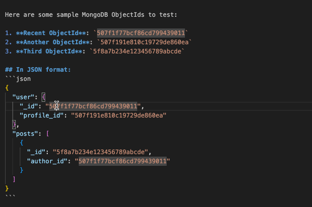
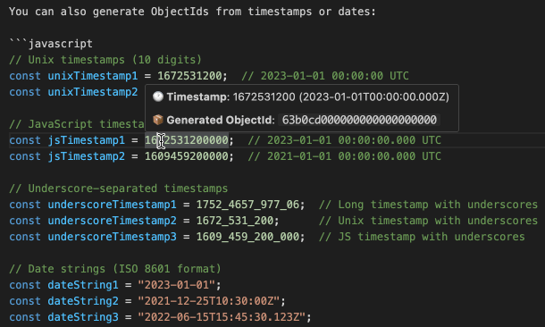

# MongoDB ObjectId Parser

A VS Code extension that parses MongoDB ObjectIds and provides detailed information on hover, including creation timestamp, machine ID, process ID, and counter.

## Features

- **ObjectId Parsing**: Automatically detects 24-character hexadecimal strings that match MongoDB ObjectId format
- **Timestamp to ObjectId**: Converts timestamps and date strings to their corresponding ObjectIds
- **Creation Time**: Shows when the ObjectId was created in a user-friendly format
- **Detailed Parsing**: Displays machine ID, process ID, and counter information
- **Universal File Support**: Works in ALL file types - source code, configuration files, logs, documentation, and more
- **Real-time Information**: Instantly shows ObjectId details without needing to manually parse

### ObjectId Parsing Example

When you hover over a MongoDB ObjectId like `507f1f77bcf86cd799439011`, you'll see:

```
MongoDB ObjectId: 507f1f77bcf86cd799439011

📅 Created At: 2012-10-17T01:00:07 GMT
🌐 ISO String: 2012-10-17T01:00:07.000Z
🔧 Details: Timestamp: 1350508407 | Machine: bcf86c | Process: d799 | Counter: 439011
```



### Timestamp to ObjectId Example

When you hover over a timestamp like `1672531200` or date string like `"2023-01-01"`, you'll see:

```
Timestamp to ObjectId: 1672531200

📅 Date/Time: 2023-01-01T00:00:00 UTC
🆔 Generated ObjectId: 63a8a900000000000000000
🔧 Details: Timestamp: 1672531200 | Machine: 000000 | Process: 0000 | Counter: 000000

Note: Machine ID, Process ID, and Counter are filled with zeros for timestamp-based generation.
```



## How to Use

### ObjectId Parsing
1. Open any file containing MongoDB ObjectIds
2. Hover over any 24-character hexadecimal string
3. View the detailed ObjectId information in the tooltip

### Timestamp to ObjectId Generation
1. Add timestamps (10 or 13 digits) or date strings to your file
2. Hover over Unix timestamps (e.g., `1672531200`)
3. Hover over JavaScript timestamps (e.g., `1672531200000`)
4. Hover over date strings (e.g., `"2023-01-01"`, `"2023-01-01T10:30:00Z"`)
5. View the generated ObjectId and its details

### Supported Timestamp Formats
- **Unix timestamps**: 10-digit numbers (seconds since epoch)
- **JavaScript timestamps**: 13-digit numbers (milliseconds since epoch)
- **Underscore-separated numbers**: Any numeric format with underscores (e.g., `1752_4657_977_06`)
- **ISO 8601 date strings**: Standard ISO formats only
  - Date only: `"2023-01-01"`
  - Date with time: `"2023-01-01T10:30:00"`
  - Date with time and milliseconds: `"2023-01-01T10:30:00.123"`
  - Date with UTC timezone: `"2023-01-01T10:30:00Z"`
  - Date with timezone offset: `"2023-01-01T10:30:00+08:00"`, `"2023-01-01T10:30:00-05:00"`

## Supported File Types

**All file types are supported!** The extension works with any file in VS Code, including:

- Source code files (JavaScript, TypeScript, Python, Java, C#, Go, Rust, PHP, Ruby, etc.)
- Data files (JSON, YAML, XML, CSV, etc.)
- Documentation files (Markdown, text files, etc.)
- Configuration files (.env, .conf, .ini, etc.)
- Log files and database exports
- Files without extensions
- Any other file type where ObjectIds might appear

The extension automatically detects 24-character hexadecimal strings that match the MongoDB ObjectId format, regardless of the file type.

## MongoDB ObjectId Format

MongoDB ObjectIds are 12-byte identifiers consisting of:
- **4-byte timestamp** (seconds since Unix epoch)
- **5-byte random value** (unique to machine and process)
- **3-byte incrementing counter** (initialized randomly)

## Requirements

- VS Code 1.74.0 or higher
- No additional dependencies required

## Installation

1. Open VS Code
2. Go to Extensions (Ctrl+Shift+X)
3. Search for "MongoDB ObjectId Parser"
4. Click Install

## Testing

A test file `test-objectids.md` is included with sample ObjectIds to test the functionality.

## Known Issues

- Currently only supports 24-character hexadecimal ObjectIds (standard MongoDB format)
- Hover detection requires exact 24-character hex strings (no partial matches)

## Release Notes

### 0.0.2

- **Universal File Support**: Now works with ALL file types, not just specific languages
- **Fixed Duplicate Hover**: Resolved duplicate content issue in TypeScript files
- **Optimized Performance**: Improved hover provider registration
- **Better Documentation**: Updated to accurately reflect universal file support

### 0.0.1

- Initial release
- Basic ObjectId parsing and hover functionality
- Support for multiple file types
- Creation time display in user-friendly format

---

## For Developers

This extension demonstrates:
- VS Code Hover Provider implementation
- MongoDB ObjectId parsing
- TypeScript best practices for VS Code extensions
- Multi-language file support

## License

MIT
